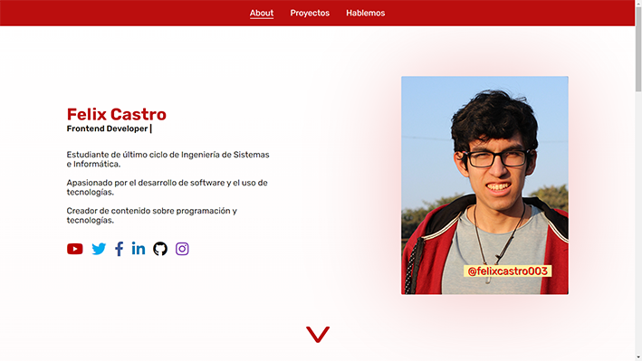

# Mi Portafolio
Proyecto para presentarme y mostrarte mis habilidades que estoy mejorando cada día.

## Demo✨
[Mirar demo](https://felixgonzalo.github.io/portafolio/)

## Acerca del proyecto 🧐
Proyecto para presentarme y mostrarte mis habilidades que estoy mejorando cada día.



## Tecnologías 🛠

- HTML
- CSS
- Sass
- JavaScript

## Instalar proyecto 👀
Clonar el proyecto
```
  git clone https://github.com/FelixGonzalo/portafolio
```
Ejecutar el archivo index.html con su navegador web favorito


## Mis redes sociales 😄
* [Youtube](https://www.youtube.com/c/FelixCastro003).
* [Facebook](https://www.facebook.com/felixcastro003).
* [LinkedIn](https://www.linkedin.com/in/felix-castro-cubas-633037192/).
* [Twitter](https://twitter.com/felixcastro003).
* [Instagram](https://www.instagram.com/felixcastro003/).
